# Augmented Fast Marching Method (AFMM) Skeletonization
"Skeletons and medial axes are of significant interest in many application areas such as object representation, flow visualization, path planning, medical visualization, computer vision, and computer animation. Skeletons provide a simple and compact representation of 2D or 3D shapes that preserves many of the topological and size characteristics of the original [1]." Skeletons are widely used in the crack width and length estimation problems. Skeleton extraction plays an important role in distinguishing the crack curvature and physcial properties in civil infrasturture maintenance. In this repository, two similar methods are implemented and presented in C, Python, Cython and Pybind:

1). Telea, Alexandru, and Jarke J. Van Wijk. "An augmented fast marching method for computing skeletons and centerlines." In EPRINTS-BOOK-TITLE. University of Groningen, Johann Bernoulli Institute for Mathematics and Computer Science, 2002. <br />
2). Reniers, Dennie, and Alexandru Telea. "Tolerance-based feature transforms." In Advances in Computer Graphics and Computer Vision: International Conferences VISAPP and GRAPP 2006, Setúbal, Portugal, February 25-28, 2006, Revised Selected Papers, pp. 187-200. Springer Berlin Heidelberg, 2007. <br />

## Methods
1. An augmented fast marching method for computing skeletons and centerlines is implemented in the [method_1](/method_1) folder. This AFMM method is a modified version from the original implementation of Alexandru et.al. [AFMM Star Implementation](https://webspace.science.uu.nl/~telea001/uploads/Software/AFMM/) and [Other Skeletonization implementations](https://webspace.science.uu.nl/~telea001/Software/Software). This method is implemented in MATLAB MEX by [Nicholas Howe](https://www.mathworks.com/matlabcentral/profile/authors/17831), original implementation can be found in [Better Skeletonization](https://www.mathworks.com/matlabcentral/fileexchange/11123-better-skeletonization). In [method_1](/method_1) folder you will find the ported implementations in `C`, `Python`, `Cython` and `Pybind`. Pybind implementations are Pythonic, exactly get `C` release performance and easy to setup for any Python virtual environment like `Anaconda`. `Cython` implementation is also quite similar to `C` performance. In contrast, native `Python` implementation is computationally slower. In this implementation, you will obtain a skeleton gradient for a binary image and local radius at each point. It was observed that for a large image [example.png](/images/example.png) the execution time was 3150 seconds. In contrast, `Go` executed in 1.2 seconds!
2. An augmented fast marching method for computing skeletons and centerlines and Tolerance-Based Feature Transforms in combination are implemented in the [method_2](/method_2) folder. This AFMM method is a exact version from the original implementation of Alexandru et.al. [AFMM Star Implementation](https://webspace.science.uu.nl/~telea001/uploads/Software/AFMM/). This method is implemented in [The Go Programming Language](https://go.dev/) by [João Ramos](https://github.com/Joao-R), original implementation can be found in [afmm](https://github.com/Joao-R/afmm). In [method_2](/method_2) folder you will find the ported implementations in `C`, `Python`, `Cython` and `Pybind`. Pybind implementations are Pythonic, exactly get `C` release performance and easy to setup for any Python virtual environment like `Anaconda`. `Cython` implementation is also quite similar to `C` performance. However it was observed that for a large image [example.png](/images/example.png) it was 4-5 times slower than the `Go`. In contrast, native `Python` implementation is computationally slowest. In this implementation, there are three main routines in the package, the first is a distance transform of the binary mask using the fast marching method (FMM). Second, this FMM is augmented to take into account the source pixel at the boundary with (AFMM). This function returns the discontinuity magnitude field of these sources, implying a centerline. Third, the all-in-one function Skeletonize which takes in a binary picture (either 3 or 2-channels) and a threshold *`t`*. It performs AFMM and then thresholds the discontinuity field to extract a new grayscale image.Image containing the skeleton and ignoring boundary effects smaller than *`t`* pixels. Lastly, you will obtain a skeleton after further skeletonizing using the `skimage.morphology skeletonize` routine to ensure the final skeleton of a binary image is *1-pixel* thick.

# Example images and skeletonization results:
## Method 1 (AFMM)
| Images | C (unthinned) | Python | Cython | Pybind|
| --- | --- | --- | --- | --- |
|  | 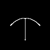 | 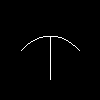 |  | 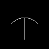 |
| Execution time (seconds) | 0.017 | 0.168 | 0.008 | 0.005 |
|  |  | 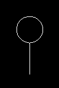 |   |  |
| Execution time (seconds) | 0.033 | 0.283 | 0.016 | 0.017 |
|  |  |  |  |  |
| Execution time (seconds) | 0.023 | 0.219 | 0.015 | 0.015 |
| 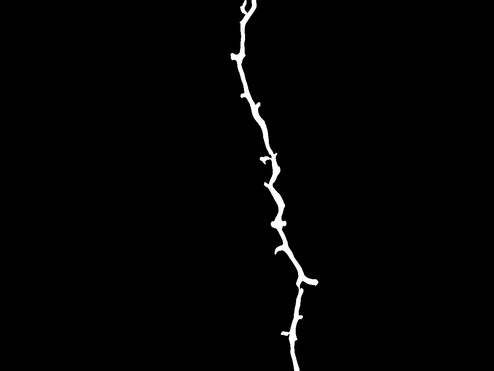 | | 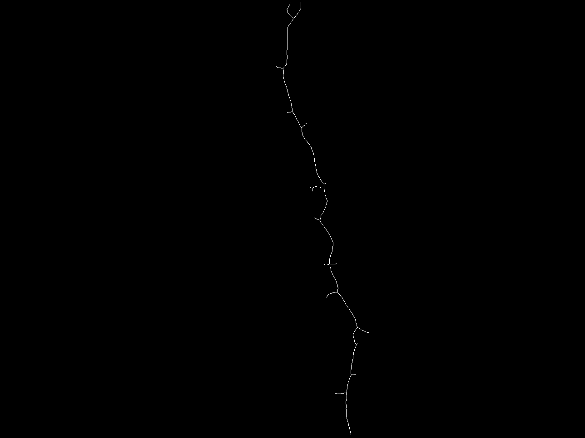 |  |  |
| Execution time (seconds) | 0.725 | 3.796 | 0.313 | 0.250 |
| 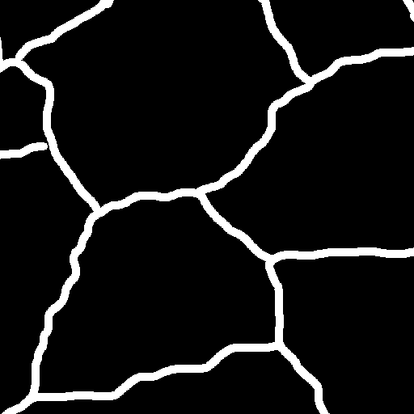 | 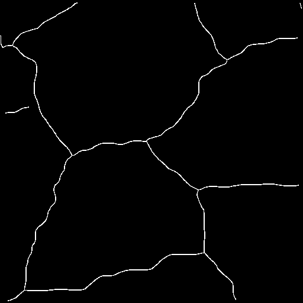 |  |  | 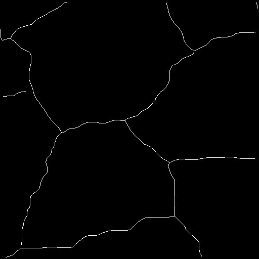 |
| Execution time (seconds) | 1.548 | 5.327 | 0.693 | 0.499 |
|  | | | | |
| Execution time (seconds) | 1000 | 1000 | 1000 | 1000 |

## Method 2 (AFMM + Tolerance-based feature transforms)
| Images | FMM | C (unthinned) | Python | Cython | Pybind|
| --- | --- | --- | --- | --- | --- |
|  | 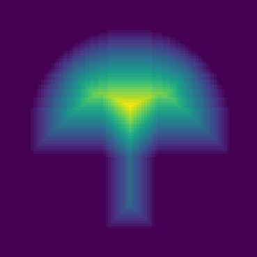 | 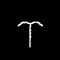 | 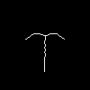 | 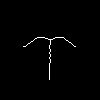 | 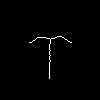 |
| Execution time (seconds) | 0.000 (C) | 0.001 | 4.422 | 0.015 | 0.000 |
|  | 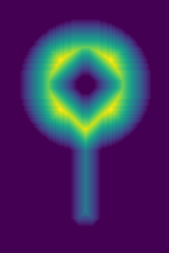 | 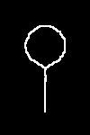 | 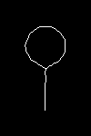 |   |  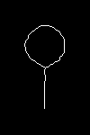|
| Execution time (seconds) | 0.001 (C) | 0.002 | 4.452 | 0.015 | 0.000 |
|  | 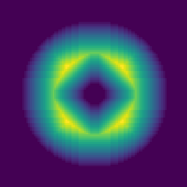 |  |  |  |  |
| Execution time (seconds) | 0.000 (C) | 0.002 | 4.469 | 0.015 | 0.002 |
|  | 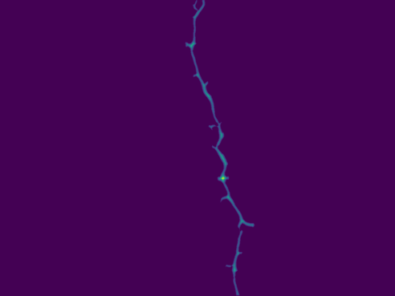 | 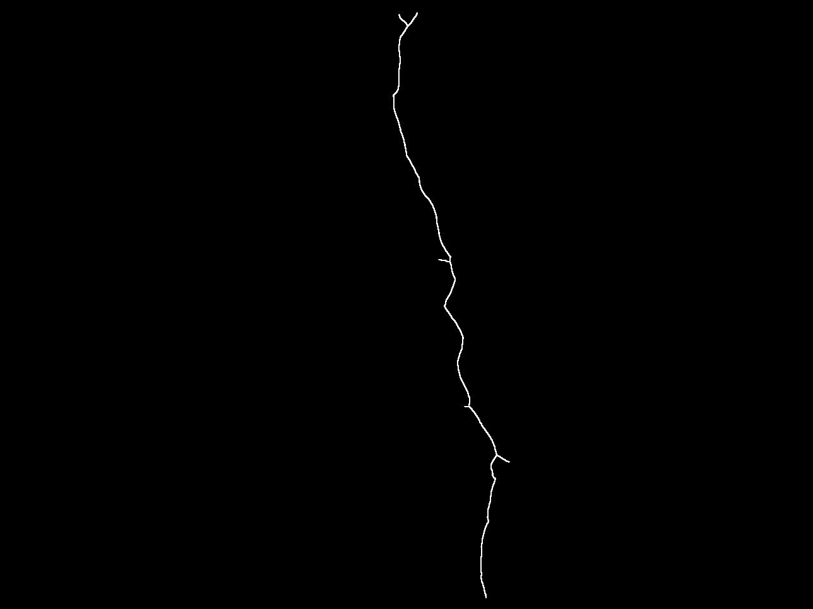 |  | 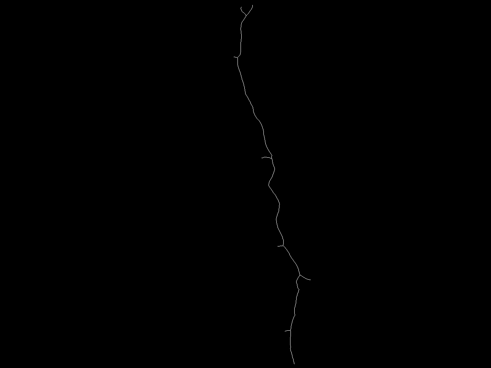 |  |
| Execution time (seconds) | 0.009 (C) | 0.017 | 4.797 | 0.179 | 0.031 |
|  | 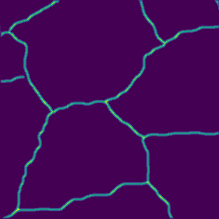 | 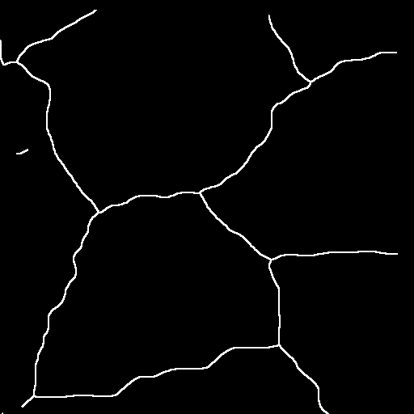 |  | 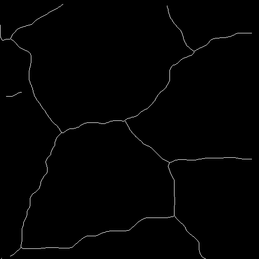 |  |
| Execution time (seconds) | 0.005 (C) | 0.008 | 4.694 | 0.111 | 0.010 |
|  | 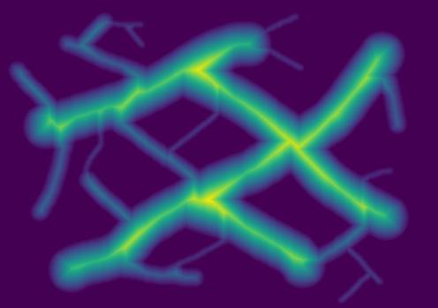 | 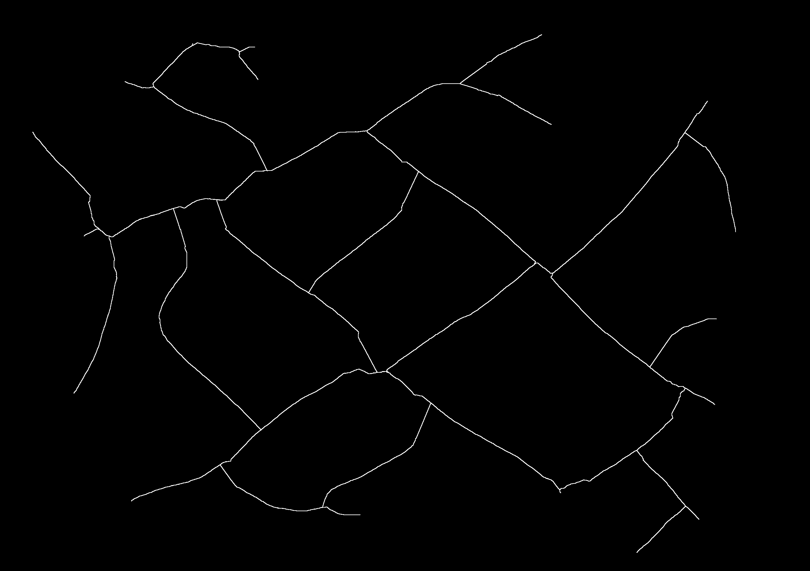 |  | 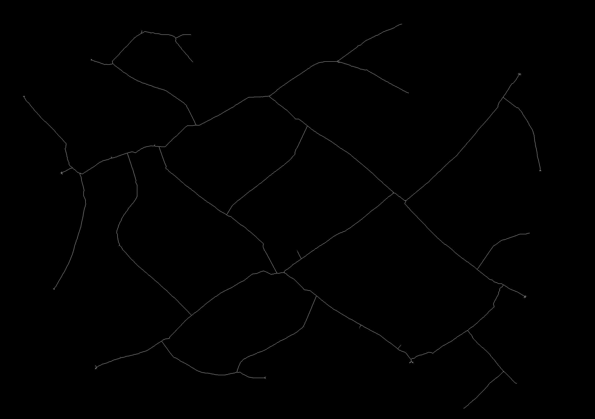 |  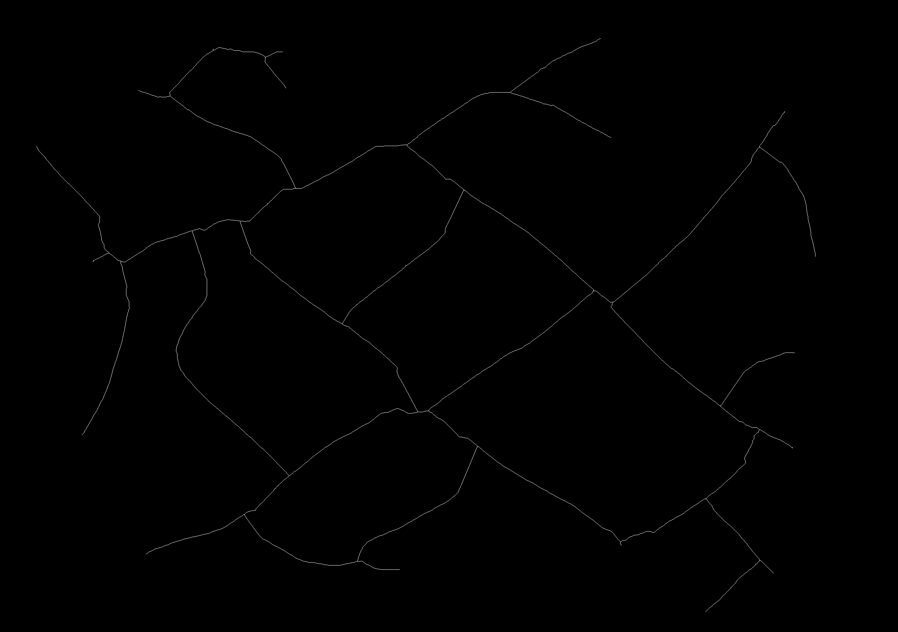 |
| Execution time (seconds) | 0.378 (C) | 0.520 | 22.769 | 5.924 | 0.422 |

# Usage
All the installation and execution details are provided in the respective programming languages, `C`, `Cython`, `Pybind`  and `Python` folders in [method_1](/method_1) and [method_2](/method_2). Please refer to the `Readme.md` files in these folders.

# Citations
Binary image skeletonization algorithm based on the AFMM and Tolerance-based feature transforms are available to the public. If you use this specific methods in your research, please use the following BibTeX entry to cite:
## Original articles
[1]. Telea, Alexandru, and Jarke J. Van Wijk. "An augmented fast marching method for computing skeletons and centerlines." In EPRINTS-BOOK-TITLE. University of Groningen, Johann Bernoulli Institute for Mathematics and Computer Science, 2002. <br />
[2]. Reniers, Dennie, and Alexandru Telea. "Tolerance-based feature transforms." In Advances in Computer Graphics and Computer Vision: International Conferences VISAPP and GRAPP 2006, Setúbal, Portugal, February 25-28, 2006, Revised Selected Papers, pp. 187-200. Springer Berlin Heidelberg, 2007.

```bibtex
@incollection{telea2002augmented,
  title={An augmented fast marching method for computing skeletons and centerlines},
  author={Telea, Alexandru and Van Wijk, Jarke J},
  booktitle={EPRINTS-BOOK-TITLE},
  year={2002},
  publisher={University of Groningen, Johann Bernoulli Institute for Mathematics and~…}
}

@inproceedings{reniers2007tolerance,
  title={Tolerance-based feature transforms},
  author={Reniers, Dennie and Telea, Alexandru},
  booktitle={Advances in Computer Graphics and Computer Vision: International Conferences VISAPP and GRAPP 2006, Set{\'u}bal, Portugal, February 25-28, 2006, Revised Selected Papers},
  pages={187--200},
  year={2007},
  organization={Springer}
}
```

## Original code repositories
[1]. Nicholas Howe (2025). Better Skeletonization (https://www.mathworks.com/matlabcentral/fileexchange/11123-better-skeletonization), MATLAB Central File Exchange. Retrieved January 7, 2025. <br />
[2]. João Ramos (2025). afmm (https://github.com/Joao-R/afmm), GitHub Repository. Retrieved January 7, 2025.

# Acknowledgements
I thank João Ramos for his invaluable time discussing on the possible solutions for porting the original `Go` code and his efforts for making the `Go` code public. I thank Nicholas Howe for writing the Method 1 `MATLAB MEX` code and making it an open-source. I thank Aniketh Manjunath ([vma1996](https://github.com/vma1996)), for his invaluable time in optimizing the Method 2 Python code by JIT compilation. Lastly, I thank Atreya Joshi and Ashwin Mahesh for the discussion and help on the usage of `Go` and its compilation.

# Feedback
Please rate and provide feedback for the further improvements.
